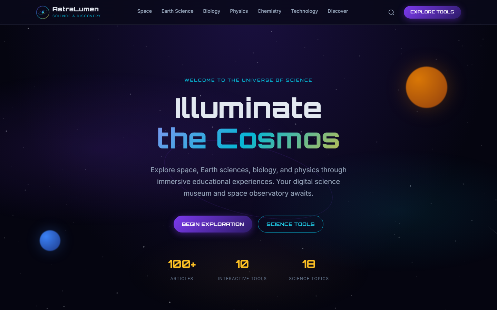

# AstraLumen

> World-class science, space & discovery platform

[](https://astralumen.vercel.app)
[](https://github.com/Ayushkumarsingh09/astralumen)

**Live demo:** [https://astralumen.vercel.app](https://astralumen.vercel.app)

Science and space discovery platform covering astronomy, missions, physics explainers, and cosmic exploration.

## Screenshots

### Homepage



## Highlights

- Science, space, and discovery publishing platform
- Astronomy, missions, and physics explainers in long-form format
- Astro + MDX content architecture
- Visual, education-first reading experience
- SEO and static hosting readiness

## Tech Stack

| Layer | Technology |
|-------|------------|
| Core | Astro, TypeScript, MDX |
| Author | Ayush |
| Live demo | https://astralumen.vercel.app |

## Quick Start

```bash
git clone https://github.com/Ayushkumarsingh09/astralumen.git
cd astralumen
npm install
npm run dev
npm run build
```

For WordPress/PHP packages, skip `npm` and follow the deployment docs in `docs/` / `DEPLOY*.md`.

## Repository Layout

```text
src/, public/, docs/, scripts/
README.md
```

## Deployment

Demo hosting: **Vercel**

- Live demo: https://astralumen.vercel.app
- Source: https://github.com/Ayushkumarsingh09/astralumen

## Author

Built and maintained by **Ayush** ([@Ayushkumarsingh09](https://github.com/Ayushkumarsingh09)).

## License

All rights reserved © AstraLumen. Published for portfolio and deployment use.
